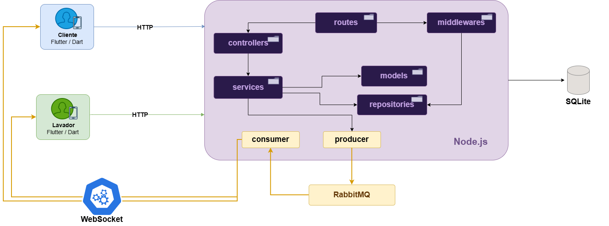
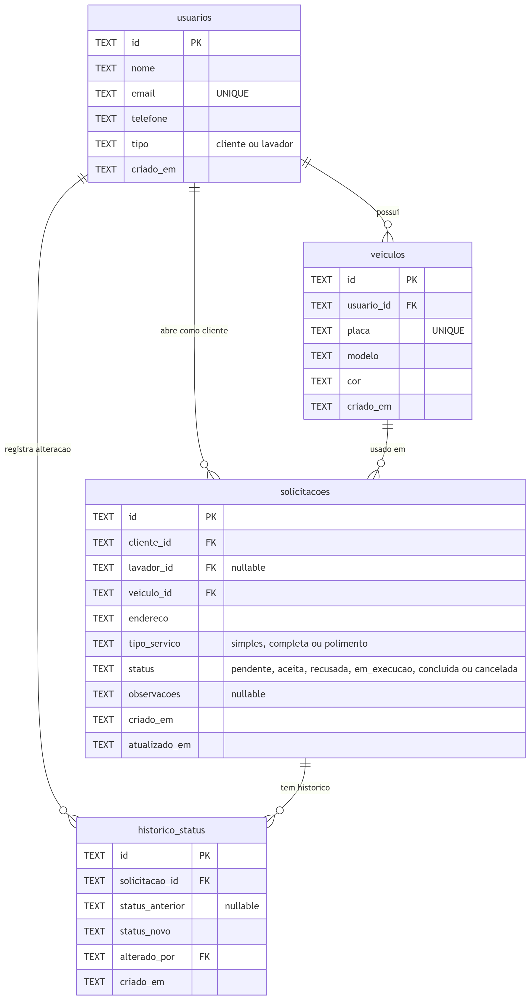

# LavaJÁ

O LavaJÁ é uma plataforma de solicitação e acompanhamento de lavagem de veículos em pontos fixos, conectando clientes a lavadores autônomos que operam em bancas de rua e estacionamentos.

---

## Arquitetura do sistema

A arquitetura adota uma abordagem orientada a eventos (Event-Driven Architecture), com separação clara de responsabilidades entre os componentes. O backend provê a API REST, a persistência e a mensageria assíncrona, enquanto os apps móveis consomem esses serviços.



**Principais componentes:**

**Apps Flutter:** dois aplicativos nativos em Flutter — um para o Cliente (dono do veículo) e outro para o Lavador (prestador de serviço). Ambos se comunicam com a API via HTTP REST e recebem notificações em tempo real via WebSocket.

**Backend (Node.js / Express):** lógica central da aplicação organizada em Clean Architecture com camadas bem definidas — middlewares, routes, controllers, services e repositories. Responsável por publicar e consumir eventos do RabbitMQ.

**Banco de dados (SQLite / PostgreSQL):** persistência relacional das informações. SQLite em desenvolvimento, PostgreSQL em produção.

**Mensageria (RabbitMQ):** orquestra os eventos da plataforma de forma assíncrona, desacoplando produtores e consumidores. Exchange `lavaja.solicitacoes` do tipo topic.

**WebSocket:** gerencia conexões persistentes para notificação em tempo real. O backend atua como gateway — consome eventos do RabbitMQ e os entrega aos apps via WebSocket. Os apps Flutter não se conectam diretamente ao broker.

---

## Modelo de dados



Schema definido em [`backend/src/config/migrate.js`](backend/src/config/migrate.js)

**Entidades e referências:**

**Usuario:** registra clientes e lavadores com nome, e-mail único e telefone. O campo `tipo` — com CHECK restrito a `cliente` ou `lavador` — diferencia os dois perfis do sistema. Relaciona-se (1:N) com Veiculos, Solicitacoes e HistoricoStatus.

**Veiculo:** armazena os veículos cadastrados pelos clientes — placa (única no sistema), modelo e cor. Pertence a um único Usuario (N:1) e pode estar associado a múltiplas Solicitacoes ao longo do tempo.

**Solicitacao:** é a transação central do sistema. Relaciona o cliente (`cliente_id`), o lavador (`lavador_id` — preenchido apenas no aceite) e o veículo para um `tipo_servico` em um endereço específico. O campo `status` — com DEFAULT `pendente` e CHECK sobre os seis estados válidos — armazena o ciclo de vida completo: `pendente → aceita → em_execucao → concluida`. Variantes de encerramento: `recusada` e `cancelada`.

**HistoricoStatus:** mantém o registro imutável de cada transição de status, gravando o estado anterior, o novo estado, quem realizou a alteração (`alterado_por` com FK para usuarios) e o timestamp exato. Permite auditoria completa do ciclo de vida de qualquer solicitação.

---

## Testes da API

Os endpoints foram documentados em uma coleção do Postman. Importe o arquivo para testar os fluxos diretamente.

O arquivo está disponível em: `LavaJA_Postman_Collection.json`

**Como usar:**
1. Importe o arquivo `.json` no Postman.
2. A variável `{{baseUrl}}` já vem configurada como `http://localhost:3000/api`.
3. Execute as requisições na ordem — os IDs são salvos automaticamente nas variáveis da coleção.

A coleção cobre os fluxos completos:
- Cadastro de cliente, lavador e veículo.
- Abertura de solicitação e acompanhamento de status.
- Aceite, início e conclusão pelo lavador.
- Cancelamento pelo cliente.
- Consulta do histórico de transições.

---

## Como rodar a aplicação

**Pré-requisitos:** Node.js 18+

```bash
# 1. Instalar dependências
npm install

# 2. Configurar variáveis de ambiente
cp .env.example .env

# 3. Iniciar o servidor
npm run dev
```

**Variáveis de ambiente (`.env`):**
```env
PORT=3000
DB_PATH=./database.sqlite
RABBITMQ_URL=amqp://localhost
NODE_ENV=development
```

Após iniciar, a API estará disponível em `http://localhost:3000/api` e o WebSocket em `ws://localhost:3000`.

> O RabbitMQ é opcional na Sprint 1. O sistema opera em modo offline caso o broker não esteja disponível.

---

## Estrutura do projeto

```
src/
├── models/          # regras de domínio — status válidos, transições
├── repositories/    # único ponto de acesso ao banco
├── services/        # lógica de negócio + publicação de eventos
├── controllers/     # interface HTTP
├── routes/          # mapeamento de URLs + middlewares
├── middlewares/     # autenticação e controle de acesso por papel
└── config/          # banco, RabbitMQ, WebSocket gateway
```

---

*Disciplina: Lab. de Desenvolvimento de Aplicações Móveis e Distribuídas — PUC Minas · 1º Semestre 2026*
*Aluna: Gabriela Alvarenga Cardoso*