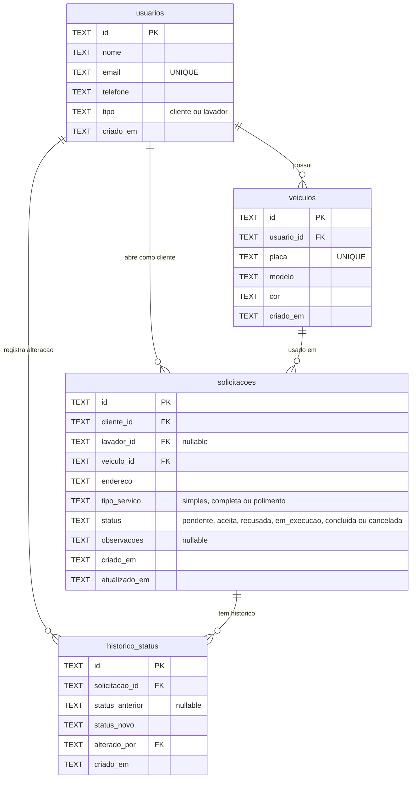

```mermaid
erDiagram
    usuarios {
        TEXT id PK
        TEXT nome
        TEXT email "UNIQUE"
        TEXT telefone
        TEXT tipo "cliente ou lavador"
        TEXT criado_em
    }

    veiculos {
        TEXT id PK
        TEXT usuario_id FK
        TEXT placa "UNIQUE"
        TEXT modelo
        TEXT cor
        TEXT criado_em
    }

    solicitacoes {
        TEXT id PK
        TEXT cliente_id FK
        TEXT lavador_id FK "nullable"
        TEXT veiculo_id FK
        TEXT endereco
        TEXT tipo_servico "simples, completa ou polimento"
        TEXT status "pendente, aceita, recusada, em_execucao, concluida ou cancelada"
        TEXT observacoes "nullable"
        TEXT criado_em
        TEXT atualizado_em
    }

    historico_status {
        TEXT id PK
        TEXT solicitacao_id FK
        TEXT status_anterior "nullable"
        TEXT status_novo
        TEXT alterado_por FK
        TEXT criado_em
    }

    usuarios ||--o{ veiculos : "possui"
    usuarios ||--o{ solicitacoes : "abre como cliente"
    usuarios ||--o{ historico_status : "registra alteracao"
    veiculos ||--o{ solicitacoes : "usado em"
    solicitacoes ||--o{ historico_status : "tem historico"
```
